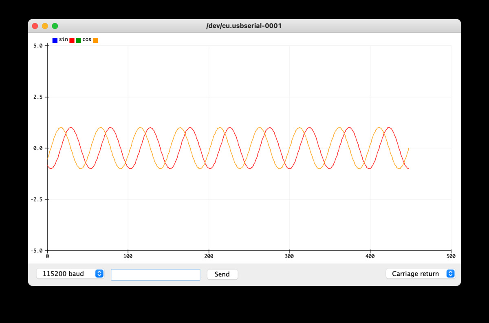
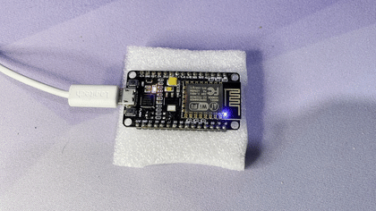
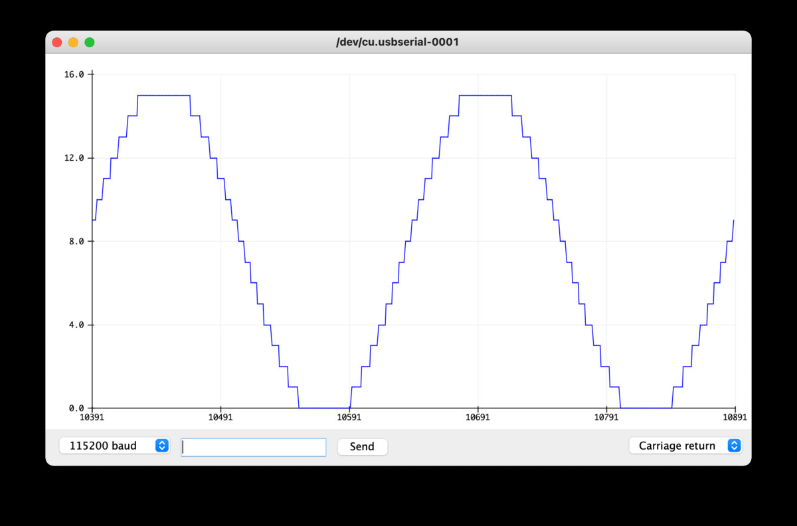
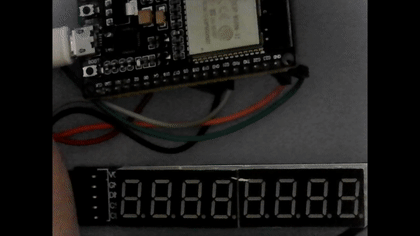

# Displaying a metric

You have a number/metric and you want to display it using an Arduino.

Arduino and associated boards often have an on board LED (light emitting diode) surely this could be usefull to display something? otherwise to program a device you end up connecting to it via a Serial interface, that same interface could be used to fetch the metric. Clearly these are small steps to get started but pretty quickly you will want to display numbers as numbers on a display like a dedicated 7 segment display or a more versatile OLED display

## Display a metric via serial port

The following sketch [metric-via-serial](./metric-via-serial/metric-via-serial.ino) is as simple is it gets. There are 2 default methods in an arduino sketch, the setup called at setup, and the loop called repeatadly whilst the Arduino is on. The setup step sets up a Serial port at 115,200 bps. The loop method repeadley prints 1,234 and waits 1,000 ms (1 second) before printing it again. Note that this will NOT mean the number gets printed accurately every second, as the printing of the number will take some number of milliseconds so don't assume the following code would be any use for a clock.

```{c}
void setup() {
  Serial.begin(115200);
}

void loop() {
  Serial.println(1234);
  delay(1000);
}
```

sets up a serial connection and displays the number 1,234 on that serial port every 1 second. You can connect to it via the `Serial Monitor` from the

  Arduino IDE -> Tools -> `Serial Monitor`

or directly from the command line as follows assuming the speed is 11,5200 bps (bits per second)

```{sh}
# check for available devices
ls /dev/cu.usb*
/dev/cu.usbserial-0001

# connect using screen
screen /dev/cu.usbserial-0001 115200

# to get help in screen (ctrl key and a key)
CTRL-a ?
# to exit
CTRL-a CTRL-\

# alternately use cu (man cu for more info)
sudo cu -s 115200 -l /dev/cu.usbserial-0001
```

## display a sine wave

As displaying the same number is not that exciting, you could easily change this code to display the values of a sine wave - [sinewave-metric](./sinewave-metric/sinewave-metric.ino).

```{c}
#define RAD_2 2 * M_PI
#define PERIOD_MILLIS 1000

double sinValue()
{
  // 1 period of a sine wave is 2𝜋
  // starting at sin(0) and ending at sin(2𝜋) or sin(2 * M_PI)
  // millis() returns the milliseconds since boot time
  const int periodOffset = millis() % PERIOD_MILLIS;
  return sin(RAD_2 / PERIOD_MILLIS * periodOffset);
}

void setup()
{
  Serial.begin(115200);
}

void loop()
{
  Serial.print(sinValue());
  delay(20);
}
```

this does not look very impressive in the `Serial Monitor`

```{log}
0.03
0.16
0.28
0.40
0.51
0.62
0.71
0.80
0.87
0.92
```

But we can not only plot the sine trigonometric function, but the cosine as well and when we pre-pend each data point with a label it can be displayed using the

  Arduino IDE -> Tools -> `Serial Plotter`

to give us something like



in this case the math function is being passed as an argument to get the associated math value. Note: also a lot of the boiler plate from the previous code snippet have been removed.

```{c}
double mathValue(double (*pMathFunction)(double rad))
{
  return (*pMathFunction)((millis() % PERIOD_MILLIS) * RAD_2 / PERIOD_MILLIS);
}

void loop()
{
  Serial.print("sin ");
  Serial.println(mathValue(std::sin));
  Serial.print(", cos ");
  Serial.println(mathValue(std::cos));
  delay(20);
}
```

## display on an LED

The serial port is not very consumer centric, given you need to connect to it manually via a screen session or IDE enabled plotter. One output device that comes on most Arduino like boards is an onboard LED (light emitting diode). Let's use that as a display next.

Using the default `LED_BUILTIN` and writing an "analog" `PWM` (pusle width modulation) signal to it can give us a pulsing light effect.

```{c}
void ledShow()
{
  // max duty for analogWrite is 2^8 - 1 = 256,
  // math values range -1 .. +1
  // following math makes duyt range 0 .. 255
  const byte duty = (128 * mathValue(std::sin)) + 128;
  analogWrite(LED_BUILTIN, duty);
}

void setup()
{
  pinMode(LED_BUILTIN, OUTPUT);
}

void loop()
{
  ledShow();
  delay(20);
}
```

in the case of the ESP8266 there is the `LED_BUILTIN` on pin `GPIO 2` and there is a second led on the board at `GPIO 16`. Below is the sine and cosine LED pulsing out by 90 degrees.



at this stage we note that the code does NOT compile for ESP32 which does not have analogWrite. Instead it has LED Control functions, `ledc...` like `ledcSetup` and `ledcAttachPin` for setting it up and `ledcWrite` for writing a duty cycle value. There is also a specific way of `ledc_set_fade_with_time` to do precisely this, fade an LED.

To separate out specific `ESP32` code we can do the following

```{c}
int duty(int maxDuty, double (*pMathFunction)(double rad) = std::sin)
{  
  const double magnitude = (*pMathFunction)((millis() % PERIOD_MILLIS) * RAD_2 / PERIOD_MILLIS);
  const int duty = ((maxDuty/2) * magnitude) + (maxDuty/2);
  return duty;
}

void ledShow()
{
#if defined(ESP32)
  ledcWrite(LEDC_CHANNEL_0, duty(MAX_DUTY));
#else
  analogWrite(LED_BUILTIN, duty(256)); // 2^8
#endif

#if defined(ESP8266) // only ESP8266 has a 2nd inbuilt LED
  analogWrite(LED_BUILTIN_ONBOARD, duty(256, std::cos));
#endif
}
```

where standard arduino has a maximum of 256 for a duty cycle where as the `ESP32` is more configurable with `MAX_DUTY` which is based on the setup:

```{c}
#if defined(ESP32)
#define LEDC_CHANNEL_0         0
#define LEDC_TIMER_13_BIT     13 // duty resolution of 13 bits 2^13 = 8192 discrete levels of LED intensity
#define MAX_DUTY            8192 // 2^LEDC_TIMER_RESOLUTION
#define LEDC_BASE_FREQ      5000 // 5kHz has maximum duty resolution of 13 bits
#endif

...

#if defined(ESP32)
  ledcSetup(LEDC_CHANNEL_0, LEDC_BASE_FREQ, LEDC_TIMER_13_BIT);
  ledcAttachPin(LED_BUILTIN, LEDC_CHANNEL_0);
#endif
```

which uses a "duty resolution" and a PWM frequency (5kHz) which is adjustable. Adusting down the duty cycle to 4 bit resolution

```{c}
ledc SEtup(LEDC_CHANNEL_0, LEDC_BASE_FREQ, 4)
...
#if defined(ESP32)
  ledcWrite(LEDC_CHANNEL_0, duty(16)); // 2^4 = 16
#else
```

will produce a more boxy, lower resolution, sine wave, here at 10 second period to exentuate it



- [ ] TODO: work out what the PWM frequency affects
- [ ] TODO: work out how to use the ledc fade functions

**Note:** the code does compile on an Arduino, but as the default `LED_BUILTIN` is not on a PWM pin it means the LED just stays on.

At this point we have strayed a little from the purpose of displaying a "vanity metric" but the LED flashing will come in handy for knowing the status of the board, like when it is fetching stats or failing to get them.

## 7 segment display

1 Old fashion way to display digits is an arrangement of 7 LED's that can be turned on and off to display all the numerals as

```
   0      1      2      3      4      5      6      7      8      9
 --            --     --            --            --     --     --
|  |      |      |      |   |  |   |      |         |   |  |   |  |
               --     --     --     --     --            --     --
|  |      |   |         |      |      |   |  |      |   |  |      |
 --            --     --            --     --            --       
```

To control 1 such digit as an LED, would require 7 outputs. This would clearly not scale to more than 2 digits. As such the digits are multiplexed, so each digit is turned on for a fraction of a second and than the next, to our eye they all look turned on as need be. To make it easier still, there are chips that drive these banks of 7 segement displays. 1 such chip is Maxim MAX7219CNG. These are often available as a prebuilt package like

- https://au.banggood.com/3Pcs-MAX7219-Red-8-Bit-Digital-Tube-LED-Display-Module-p-1029085.html

with 5 pins

1. VCC
1. GND
1. DOUT
1. LOAD
1. CLK

and this is where things can get tricky, finding a suitable driver and instructions on how to set it up and configure everything to work.

There is the recommended `LedController` library

- documentation http://wayoda.github.io/LedControl/
- source https://github.com/wayoda/LedControl

but this does NOT support ESP32 as it relies on `avr/pgmspace.h`

instead I am going to use the newer `LedController` library which builds on LedController mentioend above.

- documentation https://noah1510.github.io/LedController/english/index.html
- source https://github.com/noah1510/LedController

the basic setup would be

```
#include "LedController.hpp"

# assuming single MAX72XX module and using hardware SPI
LedController<1, 1> lc = LedController<1, 1>();

void setup()
{
  lc.init(CS);
  lc.setIntensity(8); // 0 = low, 8 = medium
  lc.clearMatrix();
}

# write 01234567
void loop() {
  lc.setDigit(0, 7, 0, false);
  lc.setDigit(0, 6, 1, false);
  lc.setDigit(0, 5, 2, false);
  lc.setDigit(0, 4, 3, false);
  lc.setDigit(0, 3, 4, false);
  lc.setDigit(0, 2, 5, false);
  lc.setDigit(0, 1, 6, false);
  lc.setDigit(0, 0, 7, false);
  delay(1000);
}
```

clearly this is write for looping and to write any number we can do

```
#define DIGITS_PER_SEGMENT  8

void writeMetric(unsigned long number)
{
  for (byte index = 0; index < DIGITS_PER_SEGMENT; index++) {
    unsigned long divisor = 1;
    for (byte offset = 0; offset < index; offset++) {
      divisor *= 10;
    }

    byte digit = number / divisor % 10;
    lc.setDigit(0, index % DIGITS_PER_SEGMENT, digit, false);
  }
}
```

Not only that but there is a sort of alphabet that can also be written using `setChar(...)` for all lower and uppercase letters. This is not perfect but understandable.

[7seg-display.ino](./7seg-display/7seg-display.ino) is an example that writes the text `"mEtric CountEr"` followed by 3 times displaying the number of `millis()` since the arduino was started

### Wiring

#### ESP32

```
       ------------------
  3V3 | |--|  |--|  |--| | GND
   EN | |  |--|  |--|  | | GPIO23  SPI_MOSI
    - |  --------------  | -
    - | |              | | -                    3V3 ======> VCC   ---   ---   ---   ---
    - | | ESP-WROOM-32 | | -                    GND ======> GND  |   | |   | |   | |   |
    - | |              | | -                    GPIO23 ===> DIN   ---   ---   ---   ---
    - | |              | | -                    GPIO5 ====> CS   |   | |   | |   | |   |
    - | |              | | GPI018  SPI_CLK      GPIO8 ====> CLK   ---   ---   ---   ---
    - | |              | | GPI05   SPI_CS0
    - |  --------------  | -
    - |                  | -
    - |                  | -
    - |                  | -
    - |                  | -
  GND | EN   _____  BOOT | GND
  VIN | [ ] / USB \  [ ] | VDD 3V3
       ------------------
```

#### ESP8266

attempts to get this running? TODO sort this out

```
#include <SPI.h> // is this needed?
#define CS 8     // GPIO17 D8 CS
```
       ------------------
 ADCO | |--|  |--|  |--| | -
  RSV | |  |--|  |--|  | | -
  RSV |  --------------  | -
    - | |              | | -          3V3 =========> VCC   ---   ---   ---   ---
    - | |   ESP-8266   | | -          GND =========> GND  |   | |   | |   | |   |
    - | |              | | -          D7 MOSI =====> DIN   ---   ---   ---   ---                    
    - | |              | | GND        D8 CS =======> CS   |   | |   | |   | |   |
    - | |              | | D5 SCLK    D5 SCLK =====> CLK   ---   ---   ---   ---
    - |  --------------  | -
  GND |                  | D7 MOSI
  3V3 |                  | D8 CS
   EN |                  | RX
  RST |                  | TX 
  GND | EN   _____  BOOT | GND
  VIN | [ ] / USB \  [ ] | 3V3
       ------------------
```



## OLED display

